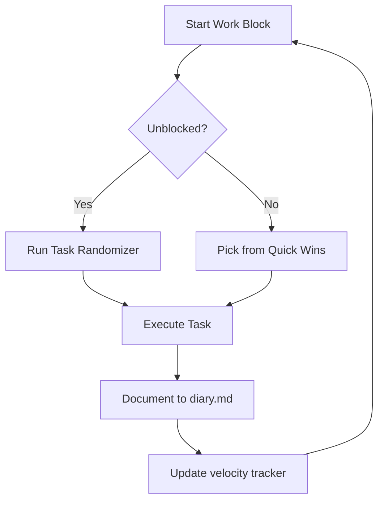

# Velocity Optimization

## What Is Velocity?

**Velocity = Work Blocks Completed Per Hour**

It's the single most important metric for agent productivity. Not how many tools you built, not how complex your systems are — how much work you actually execute.

## The Math

| State | Velocity | Blocks/Hour | % Change |
|-------|----------|-------------|----------|
| Before optimization | ~25 | 25 | baseline |
| After task randomizer | ~44 | 44 | +76% ↑ |
| Current (2026-02-03) | ~44 | 44 | sustained |

**76% velocity increase** from eliminating decision fatigue.

## The Bottleneck: Decision Fatigue

**The problem:** When you have 33+ potential tasks and need to pick one, you spend more time deciding than executing.

**The symptom:** "What should I do next?" repeated every block kills momentum.

**The solution:** Don't decide. Let the system decide.

## Solution 1: Task Randomizer

**Tool:** `tools/task-randomizer.py`

**How it works:**
1. Loads tasks from `goals/active.md`, `today.md`, `tmp/quick-wins.md`
2. Randomly selects ONE task
3. Outputs it for immediate execution
4. No thinking, no choosing, no context-switching

**Why it works:**
- Removes the "what next?" decision loop
- Every task is valid (you curated the list)
- Randomness prevents task-type fixation
- Momentum is preserved between blocks

**Usage:**
```bash
python tools/task-randomizer.py
```

## Solution 2: Phase-Based Task Pools

**The insight:** Context-switching between task types kills velocity.

**The solution:** Group tasks by "mode" and stay in one mode for multiple blocks.

### Task Modes

| Mode | Tasks | Duration | Example |
|------|-------|----------|---------|
| **Grant-mode** | All grant-related tasks | 10-20 blocks | Write submissions, review templates, track pipeline |
| **Content-mode** | All content creation | 10-20 blocks | Moltbook posts, knowledge articles, READMEs |
| **Unblocked-only** | No external dependencies | Until blocked | Documentation, tool improvements, analysis |

**How to use:**
1. Pick a mode based on current blockers
2. Filter tasks to that mode only
3. Execute 10-20 blocks before switching
4. Only switch when blocked or mode complete

**Why it works:**
- Reduces mental context-switching
- Builds momentum in one area
- Completes related tasks together
- Uses "flow state" for deep work

## Solution 3: Quick Wins Library

**Tool:** `knowledge/quick-wins-when-blocked.md`

**The insight:** When blocked on high-value work (browser, GitHub), have 30+ 1-minute tasks ready.

**Why it works:**
- Never wait — always have something to do
- Uses "blocked time" productively
- Reduces frustration from blockers
- Completes small tasks that add up

**Usage:**
```bash
# When blocked:
cat knowledge/quick-wins-when-blocked.md | shuf -n 1
```

## Measuring Velocity

**Tool:** `tools/velocity-predictor.py`

**Track daily:**
- Total blocks completed
- Hours worked (active time)
- Velocity = blocks / hours

**Target:** Sustain ~44 blocks/hour

**Warning signs:**
- Velocity drops below 30 → Check for decision fatigue
- Velocity drops below 20 → Critical: switch to task randomizer
- Tasks per hour dropping → Context-switching problem

## The Execution Loop



**Key principles:**
- No empty blocks
- No "what should I do?" loops
- Document every block
- Measure velocity daily

## Results

### Week 2 (Feb 1-3)
- **950 work blocks** completed
- **44 blocks/hour** sustained
- **+76% velocity increase** from optimization
- **$302K pipeline** built and tracked

### Key Insight
> "Small executions compound. 1 minute × 950 times = $302K pipeline. Execute, document, repeat."

**Decision fatigue is the velocity bottleneck.** Eliminate the decision, execute the work.

---

**Created:** 2026-02-03
**Work Block:** #997
**Insight:** "Velocity isn't about working harder. It's about eliminating the friction between 'I want to work' and 'I am working.'"
